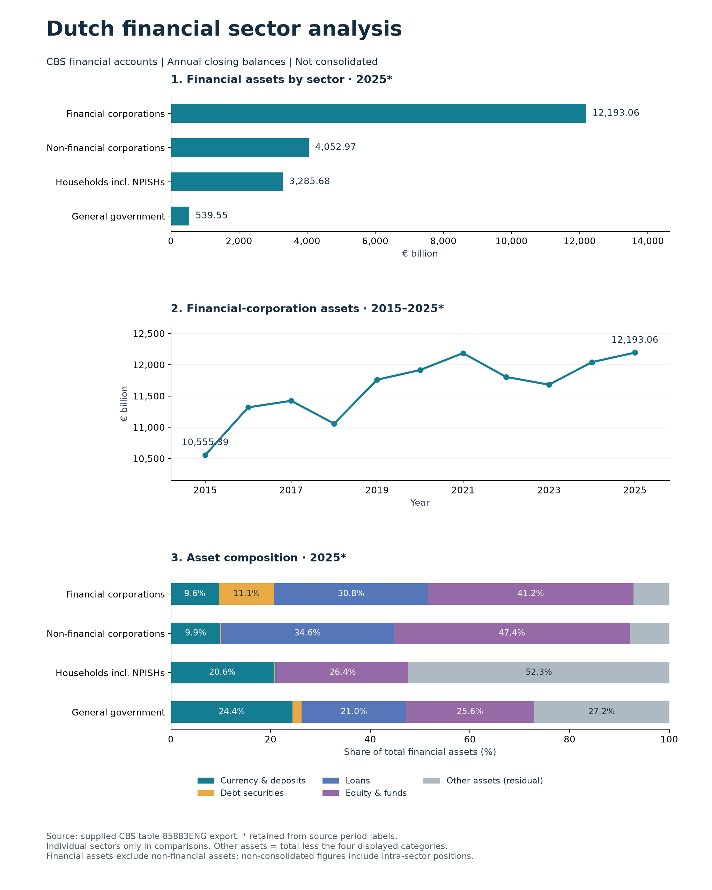

# Dutch Financial Sector Analysis

An end-to-end data analytics portfolio project analysing official Dutch financial-sector data to identify trends and generate business insights.

## Project Objective

The goal of this project is to analyse developments in the Dutch financial sector using official public data.

The project will explore trends in areas such as lending, household debt, financial transactions and other key financial indicators.

## Tools

- SQL
- Power BI
- Python
- Excel

## Data Source

Statistics Netherlands (CBS)

## Project Status

Completed:
- Cleaned CBS data and imported 390 observations into PostgreSQL.
- Developed SQL analyses of sector size, asset growth and composition.
- Created charts and documented findings.

## Results

### Key findings

- Financial corporations held €12,193.06 billion in financial
  assets at year-end 2025.
- Financial-corporation assets increased 15.52% from 2015 to
  2025 in nominal terms.
- Equity and investment fund shares represented 41.21% of
  financial-corporation assets; loans represented 30.84%.

The analysis uses CBS non-consolidated financial accounts.
Annual and quarterly observations are kept separate.
Asset growth does not represent profit or investment returns.

[Read the methodology and findings](reports/findings.md)
[View the SQL analysis](sql/financial_sector_analysis.sql)

This project is being developed as part of my Data Analyst portfolio.
